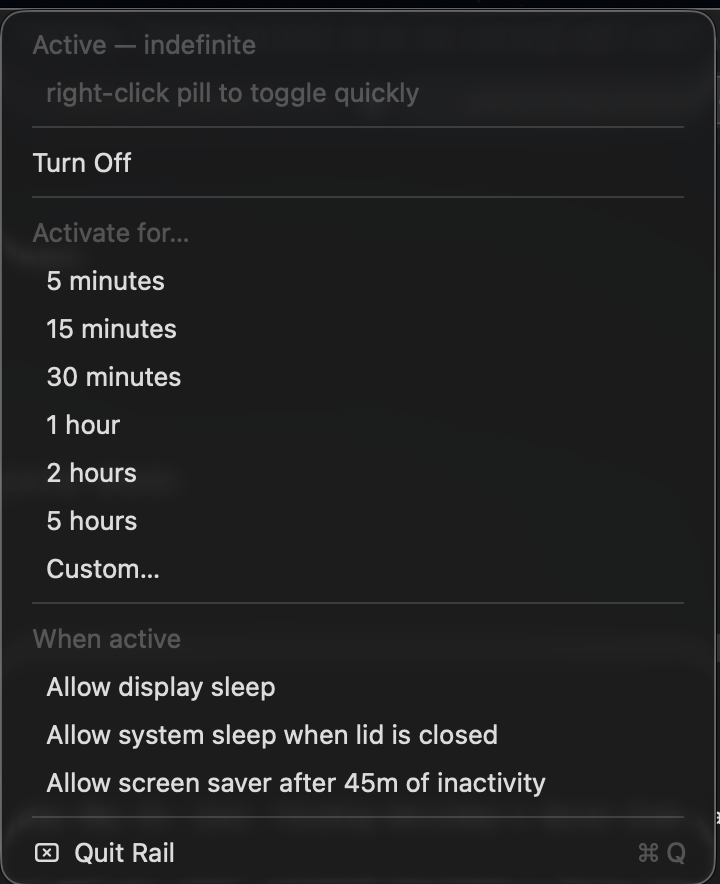

<h1 align="center">Rail</h1>

<p align="center">
  <em>Stripped-down Amphetamine for Apple Silicon Macs.</em><br/>
  Menu-bar caffeine with a syringe-into-bicep animation.
</p>

<p align="center">
  
</p>

<p align="center">
  <strong>Right-click</strong> the pill to toggle. <strong>Left-click</strong> for options.
</p>

---

## Install

**Homebrew (recommended):**

```sh
brew tap erenes1667/rail
brew install --cask rail
```

The cask strips the quarantine attribute on install, so Rail launches without the "Apple cannot check it for malicious software" prompt.

**Manual download:**

Grab `Rail.app.zip` from the [latest release](https://github.com/erenes1667/rail/releases/latest), unzip, drag to `/Applications`. Right-click the app and select **Open** the first time (Gatekeeper bypass — the app is ad-hoc signed, not notarized), or strip quarantine yourself:

```sh
xattr -dr com.apple.quarantine /Applications/Rail.app
```

**Build from source:**

```sh
git clone https://github.com/erenes1667/rail
cd rail
./build.sh --launch
```

Installs to `/Applications/Rail.app`. Builds in 30 seconds — single Swift file, zero dependencies.

---

## The menu



Checkbox state persists via `UserDefaults` and survives reboots.

---

## Why

Apple Silicon enforces lid-close sleep at the firmware level. `caffeinate` and `IOPMAssertion`-only tools (Amphetamine, KeepingYouAwake) gate the **idle** and **display** sleep paths, but not the lid switch. The only software-level escape is `sudo pmset -a disablesleep 1`.

Amphetamine has the right UI but ships with features I never used. Rail is the same shape minus the noise: pill icon, click to toggle, timer presets, three persistent checkboxes.

---

## What it does

- **Right-click pill** — toggle ON / OFF. On turn-on: syringe descends, plunger pushes, drip + jiggle, syringe yanks out, bicep flex pop with sparkles. Then settles into a continuous 2.4s flex pulse until turned off.
- **Left-click pill** — opens the options menu (stays open until click-away).
- **Timer presets** — 5m / 15m / 30m / 1h / 2h / 5h / custom. Auto-deactivates when the timer expires.
- **Three persistent checkboxes** for fine-grained sleep behavior.
- **Always cleans up** on quit, crash, Cmd-Q, or force-kill — `pmset disablesleep` gets reset on every exit path.

---

## Under the hood

| Mechanism | Purpose | Gated by |
|---|---|---|
| `IOPMAssertionCreateWithName("PreventUserIdleSystemSleep")` | Block idle system sleep | always-on while active |
| `IOPMAssertionCreateWithName("PreventUserIdleDisplaySleep")` | Block idle display sleep | "Allow display sleep" checkbox |
| `sudo -n pmset -a disablesleep 1` | Block lid-close sleep | "Allow system sleep when lid is closed" checkbox |
| `IOPMAssertionDeclareUserActivity` every 30s | Reset user-idle counter | "Allow screen saver after 45m" checkbox |
| `applicationWillTerminate` + `atexit_b` | Cleanup on quit | always |

Toggling a checkbox while active hot-refreshes the assertions.

> Requires passwordless `sudo` for `pmset`. Without it, every lid-close toggle will silently fail-open, but the system-idle and display-idle gates still work.

---

## Requirements

- macOS 13 or later
- Apple Silicon (the lid-close override is Apple-Silicon-specific; Intel Macs already allow lid-close-awake without this hack)
- Xcode command-line tools (`xcode-select --install`) — only if building from source
- Passwordless `sudo` for the lid-close behavior (optional)

---

## Repo layout

```
.
├── Rail.swift          # menu bar app, single file, ~600 lines
├── MakeIcon.swift      # procedural icon generator (powder + syringe)
├── build.sh            # compile + bundle + install pipeline
├── docs/
│   ├── rail-demo.apng  # animated demo
│   ├── rail-demo.gif   # GIF fallback for Reddit / non-APNG renderers
│   └── rail-menu.png   # menu screenshot
└── README.md
```

The icon is procedurally drawn by `MakeIcon.swift` (`NSBezierPath` on a 1024² `NSImage`, then `sips`-resized into a multi-resolution `Rail.icns`). To redesign: edit the bezier paths, then `./build.sh`.

---

## License

MIT. Do whatever.
